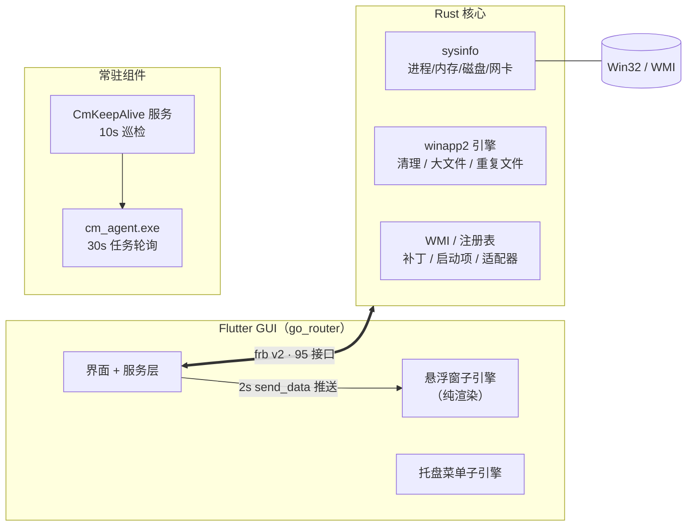

<div align="center">


[](LICENSE)
[](https://github.com/wakawakalululu/computer_manager_rebuild/actions/workflows/ci.yml)
[](#)
[](https://flutter.dev)
[](https://www.rust-lang.org)
[](#参与贡献)

**Windows 桌面系统管理工具 —— Flutter 界面 + Rust 核心，经 flutter_rust_bridge v2 无缝集成**

[功能特性](#-功能特性) · [架构](#️-架构) · [快速开始](#-快速开始) · [清理规则](#-清理规则) · [Wiki](https://github.com/wakawakalululu/computer_manager_rebuild/wiki)

</div>

---

## ✨ 功能特性

| 模块 | 能力 |
|---|---|
| 📊 **设备监控** | CPU / 内存 / 磁盘 / 网络实时仪表盘，健康评分与一键体检面板 |
| ⚙️ **进程与启动项** | 进程列表与结束、启动项启用 / 禁用、开机时长统计 |
| 📦 **应用中心** | 注册表 Uninstall 枚举、应用信息与卸载 |
| 🧹 **清理套件** | winapp2 规则引擎深度清理、大文件扫描、重复文件（内容指纹去重）、系统盘分析、回收站 |
| 🧰 **工具箱** | 网速测试（延迟 / 抖动 / 上下行）、补丁检测（WUSA / DISM / MSI / Common） |
| 🖥️ **常驻组件** | 资源悬浮窗、托盘菜单窗口、采集 Agent（30s 任务轮询）、Windows 保活服务 |
| 🔧 **系统集成** | 单实例、静默启动、关窗入托盘、资源阈值告警、点击埋点与问题反馈旁路 |

## 🏗️ 架构



- **多窗口**：悬浮窗与托盘菜单均为 `desktop_multi_window` 子引擎；子引擎内只依赖该插件自身通道，数据由主窗口推送、子引擎纯渲染。
- **构建集成**：`windows/CMakeLists.txt` 在构建期调用 cargo，自动产出 `rust_lib.dll`、`cm_agent.exe`、`cm_keep_alive.exe` 并随包安装——一条命令完成全部编译。
- **清理规则**：winapp2.ini 声明式格式，社区规则库可直接导入，详见 [Wiki · Cleaning-Rules](https://github.com/wakawakalululu/computer_manager_rebuild/wiki/Cleaning-Rules)。

## 🚀 快速开始

**前置**：Flutter stable（启用 Windows 桌面）、Rust stable-msvc、VS Build Tools（C++ 工作负载）

```powershell
git clone https://github.com/wakawakalululu/computer_manager_rebuild.git
cd computer_manager_rebuild

flutter pub get
flutter run -d windows              # 调试运行
flutter build windows --release     # 出包 → build\windows\x64\runner\Release\
```

> `assets/images/`、`assets/lottie/`、`rules/*.ini` 为运行时可选资源（不入库），
> 界面均带空态兜底；放入素材 / 规则即刻生效。

## 🧹 清理规则

深度清理由声明式规则驱动，支持环境变量展开、递归与目录自删防呆：

```ini
[示例规则]
FileKey1=%LocalAppData%\SomeApp\Cache|*.*|RECURSE
FileKey2=%WinDir%\Temp|*.log;*.tmp|RECURSE|REMOVESELF
```

规则文件放置于 exe 同目录 `rules\`；可直接选用社区库
[MoscaDotTo/Winapp2](https://github.com/MoscaDotTo/Winapp2)（CC-BY-SA-4.0）。

## 📦 发布

当前为早期版本（v0.1.0），安装包与 CI 产物在路线图中，详见 [Roadmap](https://github.com/wakawakalululu/computer_manager_rebuild/wiki/Roadmap)。

## 🤝 参与贡献

欢迎 Issue 与 PR：提交前请跑 `flutter analyze`、`flutter test` 与
`cargo test --manifest-path rust\Cargo.toml`，保持零告警。

## 📄 许可

[MIT](LICENSE) © 2026
